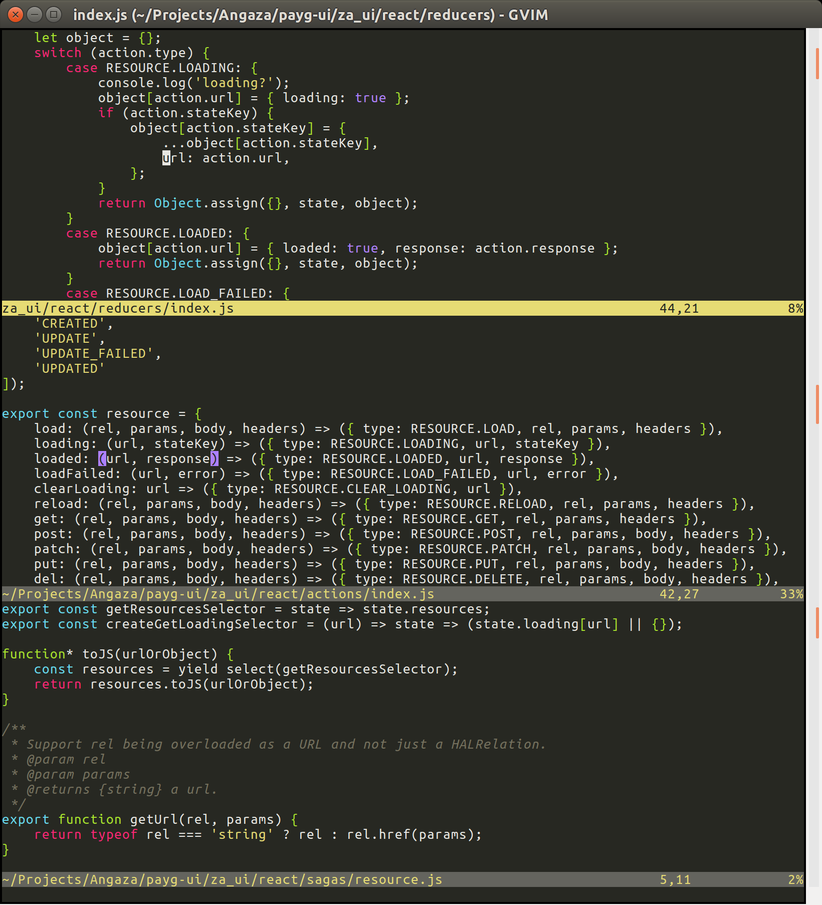

vim-monokai (forked)
====================

Refined monokai color scheme for vim. 

* Forked from [crusoexia/vim-monokai](https://github.com/crusoexia/vim-monokai)
* With a higher contrast status line, for old eyes

Example
=======

